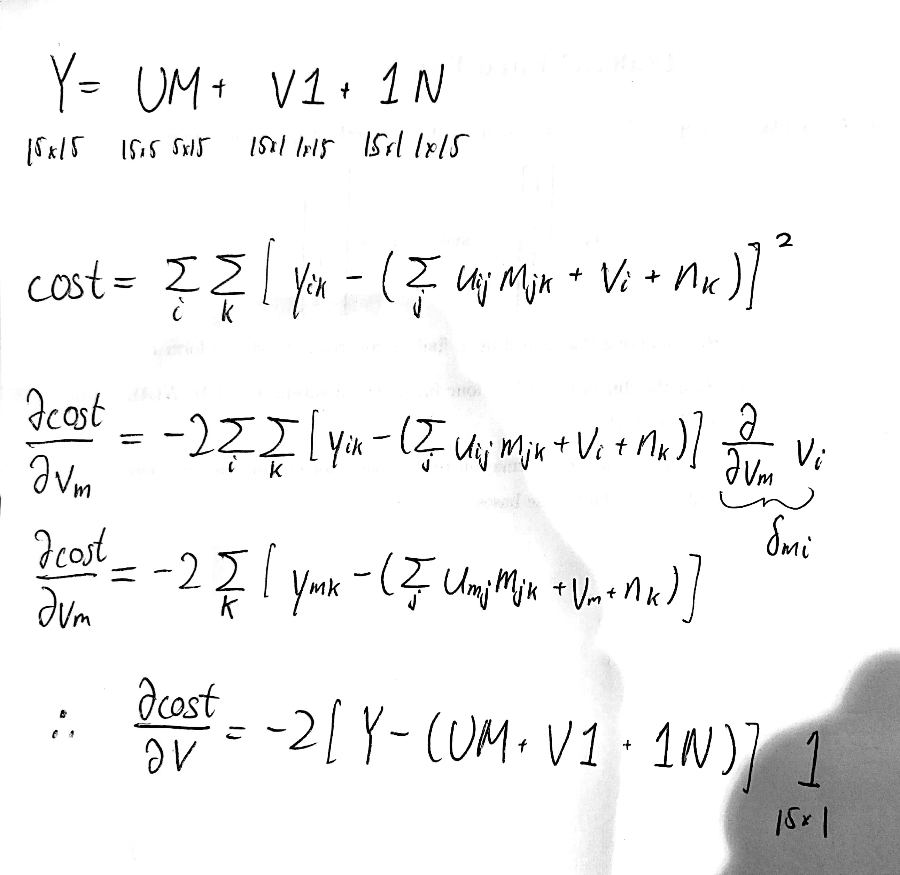

This is inspired by lecture 5 of fastai's course-v3. 
https://github.com/fastai/course-v3

```{r setup, include=FALSE}
library(tidyverse)
```

Jeremy Howard originally uses a dataset with NAs. Those NAs are left out of the calculation for the slope of the SGD but let's make our lives easier.
```{r prepare_data}
Y <- "tiny_movie_set.csv" %>%
  read_csv(col_names=FALSE, col_types=cols()) %>%
  as.matrix() %>%
  `colnames<-`(c(27,49,57,72,79,89,92,99,143,179,180,197,402,417,505)) %>%
  `rownames<-`(c(14,29,72,211,212,293,310,379,451,467,508,546,563,579,623))

#this just makes our lives easier without loss of generality...
Y[is.na(Y)] <- runif(n = Y[is.na(Y)]  %>% length(),
                     min=0, max=5)

n_users<- dim(Y)[1]
n_movies <- dim(Y)[2]
n <- n_users * n_movies
```

```{r weights}
width <- 5
set.seed(1)
U <- runif(n = n_users * width, min=0, max=5) %>%
  matrix(nrow = n_users)
M <- runif(n = width * n_movies, min=0, max=5) %>%
  matrix(ncol = n_movies)
```

```{r cost_function}
#mse is the cost function
mse <- (Y - U%*%M) %>%
  as.vector() %>%
  .^2 %>%
  mean()

rmse <- mse %>% sqrt()
```

We want to predict Y as closely as possible with our model UM, which is just a linear model. Here is the derivation for the gradient:

```{r optimize1}
lr <- 0.03
conv <- 1
while(conv> 1e-5){
  error <- (Y - U%*%M)
  
  U_grad <- -2/n * error%*% t(M)
  U <- U - lr * U_grad
  
  M_grad <- -2/n * t(U) %*% error
  M <- M - lr * M_grad
  
  error <- (Y - U%*%M)
  mse <- c(mse, error %>%
             as.vector() %>%
             .^2 %>%
             mean())
  rmse <- c(rmse, mse %>% tail(n=1) %>% sqrt())
  conv <- tail(rmse,n=2)[1] - tail(rmse,n=2)[2]
}

tibble(
  epoch = rmse %>% length() %>% seq(),
  cost = rmse
) %>%
  ggplot() +
  geom_point(aes(x=epoch, y=cost), size=0.1)
```

We can use our domain knowledge to help us out here. Some users are generally more optimistic than others and will simply rate movies higher on average. Some movies are generally better than others and will simply be rated higher on average. Instead of just Y=UM, lets add biases Y=UM + biasU*1 + 1*biasM.
```{r weights_with_bias}
width <- 5
set.seed(1)
U <- runif(n = n_users * width, min=0, max=5) %>%
  matrix(nrow = n_users)
M <- runif(n = width * n_movies, min=0, max=5) %>%
  matrix(ncol = n_movies)

biasU <- runif(n=n_users, min=0, max=5) %>%
  matrix(nrow=n_users)
onesU <- rep(1,n_users) %>% matrix(ncol=n_users)
biasM <- runif(n=n_movies, min=0, max=5) %>%
  matrix(ncol=n_movies)
onesM <- rep(1,n_movies) %>% matrix(nrow=n_users)
```

Deriving the gradient for the biases is much easier:


```{r optimize2}
mse <- (Y - U%*%M - biasU%*%onesU - onesM%*%biasM) %>%
  as.vector() %>%
  .^2 %>%
  mean()

rmse <- mse %>% sqrt()
conv <- 1

lr <- 0.03
while(conv > 1e-5){
  error <- (Y - U%*%M - biasU%*%onesU - onesM%*%biasM)
  
  U_grad <- -2/n * error%*% t(M)
  U <- U - lr * U_grad
  
  M_grad <- -2/n * t(U) %*% error
  M <- M - lr * M_grad
  
  biasU_grad <- -2/n * error %*% onesM
  biasU <- biasU - lr * biasU_grad
  
  biasM_grad <- -2/n * onesU %*% error
  biasM <- biasM - lr * biasM_grad
  
  error <- (Y - U%*%M - biasU%*%onesU - onesM%*%biasM)
  mse <- c(mse, error %>%
             as.vector() %>%
             .^2 %>%
             mean())
  rmse <- c(rmse, mse %>% tail(n=1) %>% sqrt())
  conv <- tail(rmse,n=2)[1] - tail(rmse,n=2)[2]
}

tibble(
  epoch = rmse %>% length() %>% seq(),
  cost = rmse
) %>%
  ggplot() +
  geom_point(aes(x=epoch, y=cost), size=0.1)
```