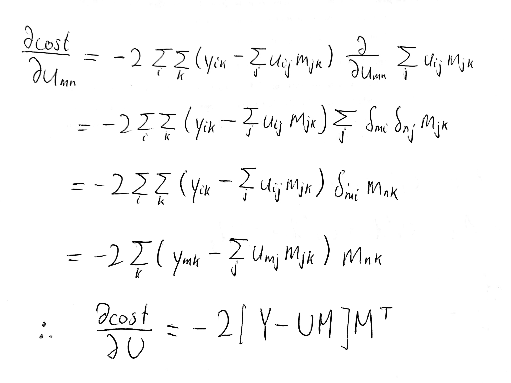

This is inspired by lecture 5 of fastai's course-v3. 
https://github.com/fastai/course-v3

```{r setup, include=FALSE}
library(tidyverse)
```

Jeremy Howard originally uses a dataset with NAs. Those NAs are left out of the calculation for the slope of the SGD but let's make our lives easier.
```{r prepare_data}
Y <- "tiny_movie_set.csv" %>%
  read_csv(col_names=FALSE, col_types=cols()) %>%
  as.matrix() %>%
  `colnames<-`(c(27,49,57,72,79,89,92,99,143,179,180,197,402,417,505)) %>%
  `rownames<-`(c(14,29,72,211,212,293,310,379,451,467,508,546,563,579,623))

#this just makes our lives easier without loss of generality...
Y[is.na(Y)] <- runif(n = Y[is.na(Y)]  %>% length(),
                     min=0, max=5)

n_users<- dim(Y)[1]
n_movies <- dim(Y)[2]
n <- n_users * n_movies
```

```{r weights}
width <- 5
set.seed(1)
U <- runif(n = n_users * width, min=0, max=5) %>%
  matrix(nrow = n_users)
M <- runif(n = width * n_movies, min=0, max=5) %>%
  matrix(ncol = n_movies)
```

```{r cost_function}
#mse is the cost function
mse <- (Y - U%*%M) %>%
  as.vector() %>%
  .^2 %>%
  mean()

rmse <- mse %>% sqrt()
```

We want to predict Y as closely as possible with our model UM, which is just a linear model. Here is the derivation for the gradient:

```{r}
lr <- 0.3

while(tail(rmse,n=1) > 0.55){
  U_grad <- -2/n * (Y - U%*%M) %*% t(M)
  U <- U - lr * U_grad
  
  M_grad <- -2/n * t(U) %*% (Y - U%*%M)
  M <- M - lr * M_grad
  
  mse <- c(mse, (Y - U%*%M) %>%
             as.vector() %>%
             .^2 %>%
             mean() %>% mean())
  rmse <- c(rmse, mse %>% tail(n=1) %>% sqrt())
}

tibble(
  epoch = rmse %>% length() %>% seq(),
  cost = rmse
) %>%
  ggplot() +
  geom_point(aes(x=epoch, y=cost), size=0.1)
```

